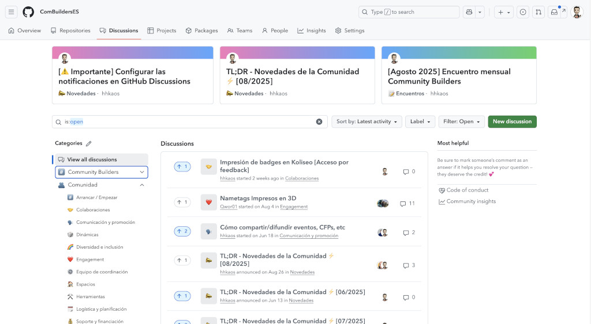

# Guía de participación en esta comunidad

¡Bienvenidx a la "metacomunidad" o comunidad de comunidades! 😃 

Aquí encontrarás lo esencial para ubicarte y elegir cómo participar.

<!-- START doctoc generated TOC please keep comment here to allow auto update -->
<!-- DON'T EDIT THIS SECTION, INSTEAD RE-RUN doctoc TO UPDATE -->

- [Quiénes somos](#qui%C3%A9nes-somos)
- [Qué hacemos](#qu%C3%A9-hacemos)
  - [Iniciativas](#iniciativas)
  - [Resumen global](#resumen-global)
- [Cómo nos comunicamos](#c%C3%B3mo-nos-comunicamos)
  - [Comunicación (por iniciativa)](#comunicaci%C3%B3n-por-iniciativa)
  - [Comunicación transversal](#comunicaci%C3%B3n-transversal)
    - [GitHub discussions](#github-discussions)
    - [Lista de correo](#lista-de-correo)
- [Próximos pasos](#pr%C3%B3ximos-pasos)
  - [Involucrarse](#involucrarse)
  - [Dudas y otros detalles](#dudas-y-otros-detalles)

<!-- END doctoc generated TOC please keep comment here to allow auto update -->

---

## Quiénes somos

Personas con ganas de formar comunidad y colaborar, guiadas por este [`código de conducta`](./CODE_OF_CONDUCT.md).

Puedes saber más sobre quienes participan activamente en [nuestra web](https://combuilderses.github.io/), o en [este fichero](https://github.com/ComBuildersES/.github/blob/main/CONTRIBUTORS.md) y en la sección `# Contributors` de cada repositorio, donde verás en qué iniciativas han colaborado.

Detalles de las personas que dinamizan comunidades y han completado <a href="https://github.com/ComBuildersES/gestion-interna/blob/main/.github/ISSUE_TEMPLATE/hacer-onboarding.md">el proceso de onboarding</a>

Para conocer motivaciones, intereses y redes  tienes:
* **PPT:** [Community Builders - Personas que forman parte de la comunidad](https://docs.google.com/presentation/d/1ResYtqrRDQIEJwsloYyW5NH1FRQJIwSqAJeuplY3bno/edit?slide=id.g2e29525fa3a_0_136#slide=id.g2e29525fa3a_0_136) (🔒)
* **Social media**: [lista en X](https://x.com/i/lists/1861687729429303706) y [starter pack en Bluesky](https://bsky.app/starter-pack/communitybuilders.bsky.social/3lbw4mhnycx2w).

También hay una [lista en GitHub](https://github.com/orgs/ComBuildersES/people) (inscripción voluntaria).

<strong>¿Cómo inscribirse para aparecer en la lista de GitHub?</strong>

Solo las personas que han completado el onboarding pueden aparecer en la lista. Para hacerlo, cambia la visibilidad de tu perfil en: `https://github.com/orgs/ComBuildersES/people/TU_NOMBRE_DE_USUARIO`:

---

## Qué hacemos

Nuestro objetivo es actuar como punto de encuentro, impulsar la colaboración y contribuir a que las comunidades crezcan sanas, atractivas, útiles y resilientes.

Este es nuestro pilar; lo concreto lo decidimos entre todas las personas de la comunidad.

### Iniciativas

Dentro de la comunidad van surgiendo distintas iniciativas en paralelo. No se trata de estar en todas, sino de encontrar al menos una que te motive y en la que quieras participar.

**Para conocer las iniciativas, filtra por [el topic "*community-builders*"](https://github.com/topics/community-builders)**.

Cada iniciativa incluye al menos tres ficheros:
* `README.md`: objetivo y participantes.
* `CONTRIBUTING.md`: cómo participar, roles, tareas y dudas frecuentes.
* `LICENSE`: licencia.

### Resumen global

Si quieres saber lo que se está haciendo, [los boletines mensuales](https://github.com/orgs/ComBuildersES/discussions/categories/novedades) lo resumen en formato [TL;DR](https://en.wikipedia.org/wiki/TL;DR):

> **Si lees un boletín**: agradecemos que reacciones con un emoji para que sepamos su alcance 🙏🙂.

## Cómo nos comunicamos

### Comunicación (por iniciativa)

La actividad de cada iniciativa debe centralizarse en su repositorio. 

Cada una puede tener sus particularidades, que estarán detalladas en su `CONTRIBUTING.md`.

### Comunicación transversal

Tenemos dos canales públicos de comunicación:

* **[GitHub discussions](#github-discussions)**: para la mayoría de comunicaciones.
* **[Lista de correo](#lista-de-correo)**: para comunicaciones importantes y urgentes.

#### GitHub discussions

Usamos [GitHub discussions](https://github.com/orgs/ComBuildersES/discussions) como foro para facilitar el networking, compartir ideas y apoyarnos mutuamente, reduciendo el ruido y organizando mejor las conversaciones.

🆘 **Sobre peticiones de ayuda** 

Al unirte puedes pedir ayuda **sin problema**, para eso estamos 😃. Eso sí, luego te tocará a ti repartir un poco de karma cuando alguien lo necesite 😜.

📢 **Comunicación de eventos propios**

Si quieres compartir información de tus eventos, lee el [hilo "Cómo compartir/difundir eventos, CFPs, etc"](https://github.com/orgs/ComBuildersES/discussions/109).

<strong>Notificaciones para equipos en GitHub</strong>

Para facilitar la segmentación de comunicaciones, hemos habilitado las [notificaciones de equipo](https://docs.github.com/es/organizations/organizing-members-into-teams/configuring-team-notifications) y estamos creando equipos. Tenemos:

* `@ComBuildersES/builders`: toda comunidad.
* `@ComBuildersES/NOMBRE_CIUDAD_O_ISLA`: personas de esa zona (o interesadas).
* `@ComBuildersES/admins`: quienes gestionan las cuentas de Community Builders.

Si te gustaría que se crease algún otro equipo, por ejemplo para dirigiste a todas las personas que organizan conferencias (ej: `@ComBuildersES/conferencias`), avísanos [en este issue](https://github.com/ComBuildersES/gestion-interna/issues/30).

 

#### Lista de correo

La lista de correo ([community-builders-es@googlegroups.com](https://groups.google.com/u/1/g/community-builders-es/)) debe servir como canal de respaldo para mensajes de interés general, como por ejemplo, el [boletín mensual](#resumen-global-mes-a-mes) que resume la actividad en todas las iniciativas, cambios en las dinámicas de la comunidad, etc.

> **🔔 Recordatorio**: Usa los *equipos* para segmentar las notificaciones en GitHub discussions.

---

## Próximos pasos

Suscríbete a las iniciativas que te interesen (apóyalas con una ⭐️) o sugiere una nueva si no la encuentras.

> ⚠️ **Importante**: si quieres recibir notificaciones por correo cuando haya nueva actividad en un foro de GitHub Discussions tienes que seguir [estas instrucciones](https://github.com/orgs/ComBuildersES/discussions/1).

### Involucrarse

Si quieres participar más activamente, puedes hacerlo a diferentes niveles:

* **Iniciativa**: busca la que te interese y revisa su [CONTRIBUTING.md](https://github.com/search?q=org%3AComBuildersES+path%3ACONTRIBUTING.md&type=code).
* **Transversal**: si quieres unirte al equipo de dinamizadores de Community Builders, consulta [este CONTRIBUTING.md](https://github.com/ComBuildersES/gestion-interna/blob/main/CONTRIBUTING.md).

<strong>¡Tenemos decenas de oportunidades para participar!</strong>

Usamos los issues y etiquetas de GitHub para organizarnos. 

Formas de participar:
- Participa en [las conversaciones](https://github.com/orgs/ComBuildersES/discussions) que te interesen.
- Respondiendo dudas en *issues* etiquetados con [question](https://github.com/search?q=org%3AComBuildersES+label%3A%22question%22+&type=issues).
- Ayudando en tareas etiquetadas como "[help wanted](https://github.com/search?q=org%3AComBuildersES%20label%3A%22help%20wanted%22%20&type=issues)".
- Dando kudos, comentando o reaccionando a las ideas propuestas ([aquí](https://github.com/orgs/ComBuildersES/discussions/categories/ideas-y-propuestas)) o propón ideas nuevas.
- Organizando o dinamizando actividades: [online](https://github.com/ComBuildersES/punto-de-encuentro/blob/main/CONTRIBUTING.md#otros-encuentros-online) o [presenciales](https://github.com/ComBuildersES/punto-de-encuentro/blob/main/CONTRIBUTING.md#encuentros-presenciales).

### Dudas y otros detalles

Si quieres saber más o si algo no te queda claro, visita el [FAQ](https://github.com/ComBuildersES/.github/blob/main/FAQ.md).

---

¡Gracias por estar aquí! ¡Tu participación hace que esta comunidad exista!
